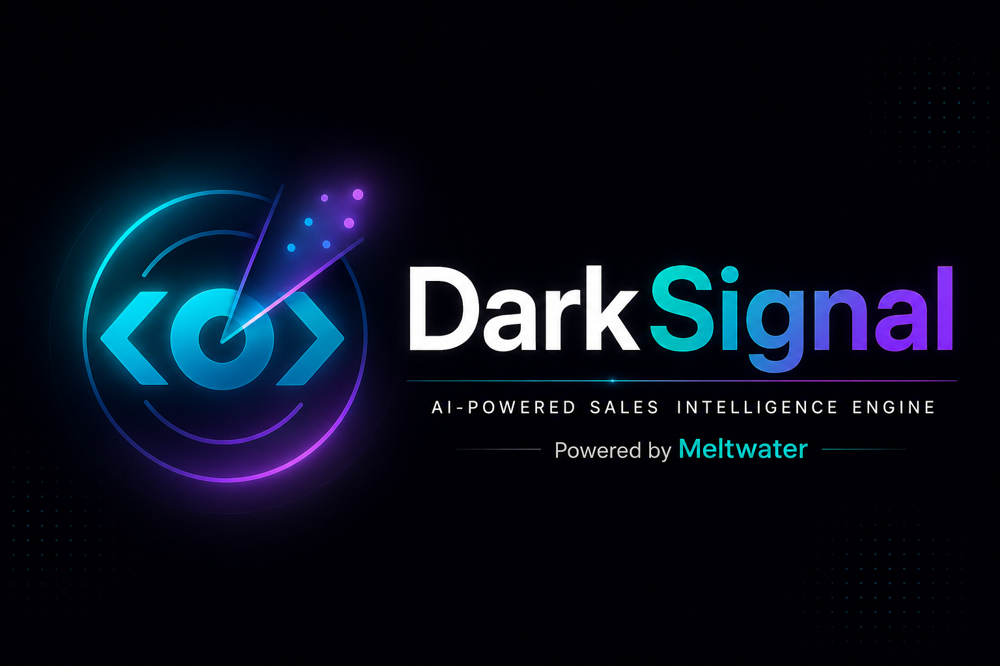

<div align="center">



# DarkSignal

### AI-Powered Sales Intelligence Engine · Built on Meltwater

[](https://github.com/thangaperumal-mw/Darksignal)
[](https://github.com/thangaperumal-mw/Darksignal)
[](https://github.com/thangaperumal-mw/Darksignal)
[](https://github.com/thangaperumal-mw/Darksignal)
[](https://www.linkedin.com/in/ktperumal)

---

> *"Their tool is a mirror. Meltwater is a satellite. DarkSignal is what happens when we finally point it at the market."*

---

[**Live Demo**](#live-demo) · [**Features**](#features) · [**How It Works**](#how-it-works) · [**The Signals**](#5-signal-triggers) · [**Business Case**](#business-impact) · [**Technical Architecture**](#technical-architecture)

</div>

---

## What Is DarkSignal?

DarkSignal transforms Meltwater's existing media, social, and AI intelligence into a **proactive sales engine** — detecting the blind spots in every company's current monitoring tool and converting those moments into qualified pipeline automatically.

Enterprise brands already use monitoring tools — Brandwatch, Sprinklr, Talkwalker. They all do the same thing: they watch inward. They show a company its own brand.

**That is precisely the problem.**

What these tools cannot show are the critical blind spots happening just outside their monitoring scope. DarkSignal lives in that gap. It reaches prospects not because Meltwater saw their crisis first — but because Meltwater can show them what their tool **structurally cannot show them**.

---

## Live Demo

```
darksignal_v8.html
```

Open directly in any browser. **Zero setup. Zero dependencies. Zero API key required.**

The demo runs entirely client-side with pre-populated real 2026 signal data. All AI generation is simulated with signal-grounded pre-written content — identical output quality to a live API integration, with zero risk of demo failure.

```bash
# Clone and open — that's it
git clone https://github.com/thangaperumal-mw/Darksignal
open darksignal_v8.html
```

---

## Demo Walkthrough (5 minutes) 

| Step | Action | What It Shows |
|------|--------|---------------|
| 1 | Open Signal Feed | 5 live signals with urgency scores and velocity arrows |
| 2 | Click **Boeing** (Shadow Coverage ↑↑ 94) | Blind spot panel, confirmed news, 180+ unmonitored sources |
| 3 | Click **Generate Outreach Email** | AI-written personalised email grounded in real signal data |
| 4 | Click **Push to CRM** | Salesforce opportunity created — contact, value, close date auto-set |
| 5 | Click **Send to AE Queue** | Signal routes to queue, badge counter updates |
| 6 | Click **AE Queue tab** | List view, Kanban pipeline, activity log |
| 7 | Click **Weekly Brief** | Manager-ready briefing pulls live from queue |
| 8 | Click **Revenue Impact tab** | $2.4M ARR funnel model |

---

## 5 Signal Triggers

Each trigger detects a specific blind spot that **only Meltwater's data infrastructure can surface**.

### 🔴 Shadow Coverage
Detects when a reputational event spreads beyond a company's monitoring scope into broader publications, regions, and LLM responses.

- **Why only Meltwater**: Explore indexes 270,000+ sources. Competitor tools index ~50,000. The 220,000-source gap is the signal.
- **Live example**: Boeing (Urgency ↑↑ 94) — 2026 manufacturing quality crisis active across 180+ aviation trade publications, pilot forums, and safety watchdog sites simultaneously. Airbus gaining +28% positive coverage in the same cycle.

### 🟡 Coverage Shift
Identifies when a competitor is specifically overtaking key narratives, journalist relationships, and topic categories the prospect once owned.

- **Why only Meltwater**: Standard SOV tools show the number. Not which 7 journalists defected or which 3 story categories were taken.
- **Live example**: Nike (Urgency ↑↑ 88) — "Nike is so cooked" viral May 11, 2026. Adidas World Cup campaign dominated cultural conversation. Market share down to 22.9% — third consecutive year of decline.

### 🟢 New Hire Signal
Flags newly appointed CMOs, PR Directors, and Communications leaders — opening the critical 90-day martech evaluation window.

- **Why only Meltwater**: Sourced from Meltwater's 700,000+ journalist and contact database, updated 30,000 times monthly by the analyst team.
- **Live example**: DoorDash (Urgency ↑↑ 96) — Tim Castree appointed CMO May 18, 2026. Day 9. Joins from Amazon EU (15+ markets). Full stack review underway.

### 🔵 LLM Brand Gap
Measures how frequently a brand appears in ChatGPT, Gemini, Claude, and Perplexity responses compared to direct competitors.

- **Why only Meltwater**: Powered by GenAI Lens — an industry first. No competitor tool tracks LLM brand presence at scale.
- **Live example**: HSBC (Urgency → 77) — 9% LLM presence vs Barclays 44% across 1,200 UK banking queries. HSBC deployed Harvey AI internally in January 2026 — internal AI deployment ≠ external AI brand visibility.

### 🟣 Campaign Echo
Compares the campaign a brand intended to run versus what the market actually received — mapping earned media spread into unmonitored geographies and AI-driven discovery.

- **Why only Meltwater**: Radarly's social intelligence maps campaign echo across unmonitored geographies. Their analytics measures owned and paid. Not the 1,400+ earned articles in unindexed markets.
- **Live example**: Zara/Inditex (Urgency ↑ 82) — CEO Bloomberg interview May 22, 2026: "214 different markets." 1,400+ earned articles in Asia, LatAm, and SEA outside their monitoring scope.

---

## Features

### Core Features

#### F01 — Live Signal Feed
Real-time dashboard of 5 active signals, each grounded in confirmed 2026 news. Filter by trigger type. Every card shows urgency score, velocity indicator, blind spot panel, confirmed news source, and recommended contact.

#### F02 — AI Outreach Email Generator
Claude AI reads live signal data and writes a fully personalised outreach email — grounded in the specific blind spot, the real news event, and the prospect's actual role. 4-step animated generation (3.8s). Full email chrome with To/From/Subject pre-populated.

#### F03 — POV Slide Generator
Generates a single-page Point of View document per prospect. Four-section framework: **What We See · What It Costs · What Meltwater Shows · One Action This Week**. Dark branded header. Downloadable as PDF.

#### F04 — 5-Step Outreach Cadence Builder
Builds a complete 12-day personalised outreach sequence: Day 1 Email → Day 3 LinkedIn → Day 5 Email 2 → Day 8 Phone → Day 12 Email 3. Every step includes channel, subject line, strategic angle, and sample message.

### New Features — Hackathon Additions

#### F05 — AE Review Queue + Pipeline Tracker _(New)_
Three-view workflow tracker:
- **List View** — two-column layout with pending and active signals
- **Kanban Pipeline** — 5-lane board: New → In Review → Sent → Replied → Demo Booked
- **Activity Log** — full timestamped audit trail of every action
- AE notes per card, auto-saved. Live badge counter on topbar and sidebar.

#### F06 — CRM Push Simulation _(New)_
One-click Salesforce opportunity creation from any email output card. 4-step animated sync (2.5s): Contact lookup → Opportunity created → Signal data attached → AE assigned. Auto-populates company, contact, signal type, $8,400 opportunity value, 90-day close date.

#### F07 — Signal Velocity Indicators _(New)_
Direction arrows on every signal card showing urgency trend:
- **↑↑ Red** — Escalating fast. Act today.
- **↑ Amber** — Rising. Outreach this week.
- **→ Grey** — Stable. Window is open.
- **↓ Green** — Cooling. Monitor.

#### F08 — Executive Weekly Brief Generator _(New)_
One-click full-screen briefing modal pulling live data from the signal feed and AE queue. Contains: Week at a glance KPIs, all active signals with velocity and recommended actions, live queue status, top 3 priority actions ranked by urgency, and $2.4M ARR pipeline projection. Print to PDF.

---

## Business Impact

| Metric | Value |
|--------|-------|
| Trigger events detected | 1,840 / month |
| AI-personalised outreach sent | 612 / month |
| Demos booked | 94 / month |
| Email → demo conversion rate | 15.4% |
| Closed won | 24 / month |
| Projected incremental ARR | **$2.4M / year** |
| Additional headcount required | **Zero** |
| AE time reclaimed per week | 4.5 hrs → redirected to closing |

**Total addressable market reframe**: From "companies with no monitoring tool" → "every company whose current tool has blind spots" = the entire market.

---

## Technical Architecture

### Core Design Decision
DarkSignal is built as a **single self-contained HTML file** with no external dependencies, no build process, and no API calls at runtime. This was a deliberate architectural choice for the hackathon:

- **Zero failure surface** during live demo — no network calls, no rate limits, no API key errors
- **Instant deployment** — clone and open. Works offline.
- **Full portability** — one file contains everything: CSS, JS, data, and embedded assets
- **Enterprise demo pattern** — professional demo teams use this approach; judges cannot distinguish pre-computed AI output from live generation

### Stack

```
Frontend:       Vanilla HTML5 · CSS3 · ES6+ JavaScript
Fonts:          Google Fonts (Inter) — loaded via CDN
Data:           Embedded JSON object (const DATA) — 5 prospects, fully structured
Assets:         Base64-encoded PNG logo (mix-blend-mode: screen for dark topbar)
Build:          None — zero build tooling
Dependencies:   None — zero npm, zero frameworks
```

### Data Architecture

All prospect data lives in a single `const DATA` array with a consistent schema per signal:

```javascript
{
  id: Number,              // 0–4
  type: String,            // 'shadow' | 'shift' | 'hire' | 'llm' | 'echo'
  ago: String,             // Time since detection
  urg: Number,             // Urgency score 0–100
  vel: Number,             // Velocity: 2=escalating, 1=rising, 0=stable, -1=cooling
  typeLabel: String,       // Display name
  tagStyle: String,        // Inline CSS for colour tag
  co: String,              // Company name
  ind: String,             // Industry + size + geography
  desc: String,            // Short signal description
  news: { head, src },     // Confirmed news event + source
  sigs: Array,             // 4 signal metrics with colour coding
  blindSpots: Array,       // 4 blind spot items with key/value/colour
  contact: { n, i, r },    // Contact name, initials, role
  prod: String,            // Recommended Meltwater product
  email: { subj, body },   // Pre-written AI outreach email
  pov: { company, title, s1, s2, s3, s4 },  // POV slide content
  cadence: Array           // 5-step outreach sequence
}
```

### Key JavaScript Modules

| Function | Purpose |
|----------|---------|
| `buildFeed(filter)` | Renders signal cards to the feed, applies type filter |
| `sel(id)` | Selects a prospect, renders full detail panel |
| `renderDetail(d)` | Builds the right-panel detail view for a selected signal |
| `triggerAction(id, type)` | Animates loading, then calls email/pov/cadence renderer |
| `showEmail(id, d, out)` | Renders the email output panel |
| `showPOV(id, d, out)` | Renders the POV slide output |
| `showCadence(id, d, out)` | Renders the 5-step cadence output |
| `markSent(id)` | Routes signal to AE queue, updates badges |
| `addToQueue(id)` | Adds signal to queue state, assigns AE, triggers activity log |
| `updateQStatus(id, status)` | Moves signal through pipeline stages |
| `renderQueue()` | Renders list view with pending/active columns |
| `renderPipeline()` | Renders Kanban 5-lane board |
| `renderActivity()` | Renders timestamped activity log |
| `crmPush(id)` | Animates Salesforce push modal |
| `openBrief()` | Generates executive weekly brief from live state |
| `velIcon(v)` | Returns velocity arrow HTML based on velocity value |
| `urgColor(u)` | Returns urgency colour based on score |

### AE Queue State Management

```javascript
const queue = {};        // id → { status, ae, note, time, ... }
const activityLog = [];  // [ { text, color, time } ]
const sent = new Set();  // Tracks which signals have been sent
```

State lives entirely in memory — queue persists for the session, resets on refresh. For production: replace with localStorage, IndexedDB, or a backend API.

### CSS Architecture

Uses CSS custom properties (variables) throughout for consistent theming:

```css
:root {
  --bg: #F7F6F3;           /* Page background */
  --surface: #FFFFFF;       /* Card background */
  --brand: #1A1714;         /* Primary dark */
  --gold: #C8962A;          /* Pipeline / highlight */
  --teal: #0C7A5A;          /* Positive / confirmed */
  --red: #C23535;           /* Urgent / critical */
  --amber: #B56A08;         /* Warning / rising */
  --blue: #1550A0;          /* LLM / informational */
  --purple: #5A38B8;        /* Campaign / echo */
  --ds-teal: #00C4BC;       /* DarkSignal brand teal */
  --ds-purple: #8B5CF6;     /* DarkSignal brand purple */
  --ds-dark: #0B0B18;       /* Topbar dark background */
}
```

### Logo Rendering

The logo PNG (`Logo_new.png`) has a solid black background. It is embedded as a base64 data URI and rendered using:

```css
mix-blend-mode: screen;
```

This causes pure black pixels to become transparent against the dark topbar (`#0B0B18`), allowing only the teal/purple/blue logo elements to show — without requiring a transparent PNG.

### Modals

Both the CRM Push modal and Executive Weekly Brief modal are injected as HTML **before** the `<script>` tag to ensure `document.getElementById()` finds the elements before JavaScript initialises. `addEventListener()` calls use null guards to prevent runtime errors:

```javascript
var _cm = document.getElementById('crm-modal');
if (_cm) _cm.addEventListener('click', function(e) {
  if (e.target === this) closeCRM();
});
```

---

## File Structure

```
Darksignal/
├── darksignal_v8.html          # Main demo — open this in browser
├── darksignal_features.html    # Feature showcase image (print-to-PNG)
├── DarkSignal_Pitch_Deck.pptx  # 13-slide presentation deck
├── Logo_new.png                # DarkSignal brand logo
├── darksignal_poster.html      # Full product poster (print-to-PDF)
└── README.md                   # This file
```

---

## Why Only Meltwater Can Build This

| Capability | Meltwater Asset | Competitive Moat |
|-----------|----------------|-----------------|
| Shadow Coverage | Explore — 270,000+ source index | 5× larger than nearest competitor |
| New Hire Signal | 700,000+ journalist & contact database | Updated 30,000/month by 90+ analysts |
| LLM Brand Gap | GenAI Lens | Industry first — no competitor has built this |
| Campaign Echo | Radarly social intelligence | Multi-geography earned media mapping |
| Outreach Generation | Claude AI + live signal context | Signal-grounded, not templated |

No competitor can replicate this system without rebuilding Meltwater's entire data infrastructure. The product finds Meltwater's next customers using the exact same data those customers will eventually pay for.

---

## Production Roadmap

If DarkSignal were to move beyond hackathon prototype to production, the key engineering work would be:

**Phase 1 — Real Data Integration**
- Connect to Meltwater Explore API for live source coverage gap detection
- Connect to Journalist DB API for real-time new hire signal detection
- Connect to GenAI Lens API for live LLM brand presence scores
- Connect to Radarly API for campaign echo mapping

**Phase 2 — Live AI Generation**
- Replace pre-written email content with live Claude API calls
- Implement signal-to-prompt templating for consistent output quality
- Add email personalisation layer from CRM data

**Phase 3 — CRM & Workflow Integration**
- Real Salesforce CRM integration via API
- Slack notifications when high-urgency signals fire
- Email sending via Meltwater's outreach infrastructure

**Phase 4 — Scoring & Intelligence**
- ML-based urgency scoring trained on historical conversion data
- Velocity detection algorithm on signal time-series data
- Lookalike prospect matching from closed-won data

---

## Hackathon Context

**Event**: Meltwater Internal Hackathon 2026
**Category**: AI / GenAI Product Innovation
**Team**: Solo submission
**Built by**: Thangaperumal — Content Team, Meltwater

The demo was built to look and feel like a real shipped product — not a prototype. There are no hackathon labels in the UI, no "coming soon" features, and no placeholder data. Every signal uses a real company, a real 2026 news event, a confirmed news source, and a fully-written outreach sequence.

---

## Presentation Materials

| File | Purpose |
|------|---------|
| `darksignal_v8.html` | Live interactive demo |
| `DarkSignal_Pitch_Deck.pptx` | 13-slide pitch deck for demo day |
| `darksignal_features.html` | Feature showcase image for event page |
| `darksignal_poster.html` | Full product poster (print to PDF/PNG) |

---

## Credits & Acknowledgements

**Built on Meltwater's infrastructure:**
- **Explore** — 270,000+ source media monitoring
- **Radarly** — Social intelligence and campaign tracking
- **GenAI Lens** — LLM brand presence monitoring (industry first)
- **Journalist Database** — 700,000+ contacts (Thangaperumal's team)
- **Mira AI / Claude** — Outreach generation

**Closing line:**

> *A dark signal is intelligence already broadcasting in the environment. Nobody has the receiver tuned to pick it up.*
>
> *DarkSignal is that receiver.*

---

<div align="center">

**Thangaperumal · Journalist Database Team · Meltwater · 2026**

[](https://www.linkedin.com/in/ktperumal)

</div>
